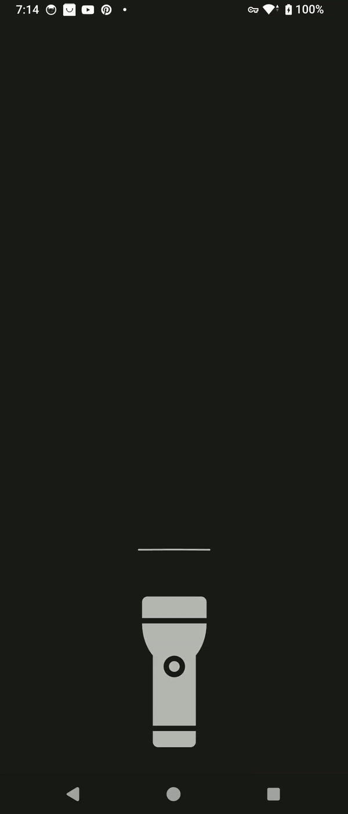

# Android Flashlight Control Animation

This project recreates the iOS 18 flashlight animation on Android using Jetpack Compose. It
demonstrates advanced animation techniques and gesture handling to create a fluid, interactive user
experience.

## Approach

The animation is built using several key Jetpack Compose features:

1. **State Management**: `rememberSaveable` and `mutableStateOf` are used to manage the on/off state
   of the flashlight.

2. **Animations**: `Animatable` is used for smooth transitions of various UI elements.

3. **Gesture Handling**: `pointerInput` detects tap and drag gestures to control the flashlight and
   animation states.

4. **Custom Drawing**: Custom composables like `CurvedBar` and `LightRay` are used to create the
   visual effects.

5. **Constraint Layout**: Used for precise positioning of UI elements.

The animation responds to user interactions, allowing them to turn the flashlight on/off with a tap
or by dragging up/down. The light intensity and spread are controlled by the drag distance, creating
a dynamic and engaging user interface.

## Comparison with iOS

Here's a comparison of our Android implementation with the original iOS 18 flashlight animation:

| Android Implementation             | iOS 18 Original            |
|------------------------------------|----------------------------|
|  |  |

Our Android implementation closely mimics the fluidity and interactivity of the iOS version,
showcasing the power and flexibility of Jetpack Compose for creating complex, custom animations.

## Key Features

- Tap to toggle flashlight on/off
- Drag to control light intensity and spread
- Animated curved bars to enhance visual feedback
- Dynamic light ray effect
- Smooth transitions between states
